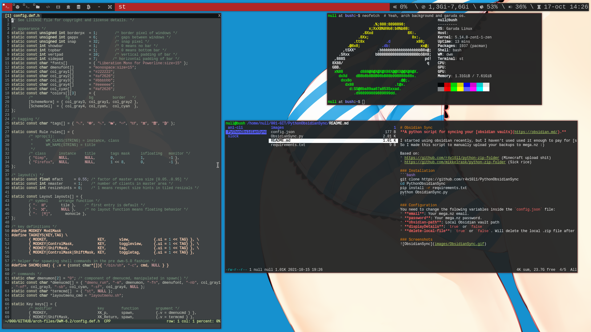

<div align="center">
  <h1>dwm installation in arch</h1>
  <b>Installation process of <a href="https://dwm.suckless.org/">dwm</a> in <a href="https://archlinux.org/">arch</a> / <a href="https://garudalinux.org/">garuda linux</a>.</b><br>
  Simple version <a href="https://github.com/r4v10l1/dwm-lite">here</a>.
</div>

## Table of contents
1. [Requirements](https://github.com/r4v10l1/arch-files#Requirements)
2. [Keys](https://github.com/r4v10l1/arch-files#Keys)
3. [Process](https://github.com/r4v10l1/arch-files#Process)
	- [dwm](https://github.com/r4v10l1/arch-files#dwm)
	- [st](https://github.com/r4v10l1/arch-files#st)
	- [dmenu](https://github.com/r4v10l1/arch-files#dmenu)
	- [xmenu](https://github.com/r4v10l1/arch-files#xmenu)
	- [slock](https://github.com/r4v10l1/arch-files#slock)
	- [bashrc](https://github.com/r4v10l1/arch-files#bashrc)
	- [Scripts](https://github.com/r4v10l1/arch-files#Scripts)
	- [nvim](https://github.com/r4v10l1/arch-files#nvim)
4. [Extra](https://github.com/r4v10l1/arch-files#Extra)
4. [Todo](https://github.com/r4v10l1/arch-files#Todo)
5. [Screenshots](https://github.com/r4v10l1/arch-files#Screenshots)

---

## Requirements:
### Files:
1. Create folders.
	```bash
	mkdir -p ~/000/GITHUB
	``` 
2. Clone the repo to `~/000/GITHUB`.
	```bash
	cd ~/000/GITHUB
	git clone https://github.com/r4v10l1/arch-files
	```
### Packages:
Install the required packages for `ras`:
```bash
sudo pacman -S feh compton acpi picom
```
The required packages for `dwm`:
```bash
sudo pacman -S xorg xorg-xinit
```
The required packages for `surf`:
```bash
sudo pacman -S hspell aspell nuspell libvoikko
```
And the required font from the aur:
```bash
yay -S ttf-font-awesome dina-font
```

## Keys:
All the keys and shortcuts can be found [here](https://github.com/r4v10l1/arch-files/blob/main/dwm-cheatsheet.md).

## Process:
### dwm
We will install dwm 6.2.
```bash
cd ~/000/GITHUB/arch-files/DWM-6.2
# rm config.h
sudo make clean install  # Prepare for the errors?
```

#

### st
Make the `.font` folder and copy the powerline font in there.
```bash
cd ~/000/GITHUB/arch-files/fonts
mkdir ~/.fonts
cp -r powerline-fonts ~/.fonts
c-list | grep power  # Check that all is fine
```
We will install 0.8.2 because of the extensions.
```bash
cd ~/000/GITHUB/arch-files/ST-0.8.2
# rm config.h
sudo make clean install  # Prepare for the errors?
```
**You can scroll the terminal with shift+mwheel**

#

### dmenu
Enter the `DMENU` folder and install.
```bash
cd ~/000/GITHUB/custom_arch/DMENU/
sudo make clean install
```

#

### xmenu
Enter the `XMENU` folder and install.
```bash
cd ~/000/GITHUB/custom_arch/XMENU/
sudo make clean install
```

#

### slock
Enter the `SLOCK` folder and install.
```bash
cd ~/000/GITHUB/custom_arch/SLOCK/
sudo make clean install
```

#

### .bashrc
Make a backup and copy the `.bashrc` to `~/.bashrc`
```bash
cp ~/.bashrc ~/.bashrc.bak  # Make a backup
cd ~/000/GITHUB/arch-files/dotfiles/bashrc  # Yes it is a folder
cp bashrc ~/.bashrc  # Copy the actual file
```
Need to ~~download~~ copy `.git-prompt.sh`
```bash
#curl -o ~/.git-prompt.sh https://raw.githubusercontent.com/git/git/master/contrib/completion/git-prompt.sh
cp ~/000/GITHUB/arch-files/dotfiles/bashrc/git-prompt.sh ~/.git-prompt.sh
```
Add it to the `.bashrc` if you use your own:
```bash
echo "source ~/.git-prompt.sh" >> ~/.bashrc
```

#

### .xinitrc
Make a backup and copy the `.xinitrc` to `~/.xinitrc`
```bash
cp ~/.xinitrc ~/.xinitrc.bak  # Make a backup (The file might not exist!)
cd ~/000/GITHUB/custom_arch/dotfiles/xinitrc  # Yes it is a folder
cp xinitrc ~/.xinitrc  # Copy the actual file
```
Add `startx` to the `~/.bash_profile`
```bash
echo "startx" >> ~/.bash_profile  # Append to the file
```

#

### Scripts
- Group 1.
	```bash
	cat ~/000/GITHUB/arch-files/Scripts/Group1/README.txt  # Copy to /usr/local/bin
	# Just do what the file says
	```
- Group 2.
	```bash
	cat ~/000/GITHUB/arch-files/Scripts/Group2/README.txt
	# Change the file name from 'dwmbar' to '.dwmbar' and copy it to ~
	# Just do what the file says
	```

#

### nvim
[Go to the vim-dotfiles repository.](https://github.com/r4v10l1/vim-dotfiles)

---

## Extra
- You might need to edit the grub config to launch garuda linux in terminal mode. [Help here.](https://forum.garudalinux.org/t/how-to-open-garuda-linux-in-text-console/7613)
- You might need to install `iwd`, `dialog` and `dhcpcd`.
- For natural scrolling, you can install `xf86-input-libinput` and add this to `/etc/X11/xorg.conf.d/30-touchpad.conf`:
	```conf
	Section "InputClass"
		Identifier "r4v10l1-rocks"
		Driver "libinput"
		Option "Tapping" "on"
		Option "NaturalScrolling" "true"
	EndSection
	```
- For audio and microphone, install `alsa-utils`. Then enable and change volumes with the `alsamixer` command.
	```bash
	sudo pacman -S alsa-utils alsa-plugins alsa-lib pulseaudio-alsa pulseaudio
	alsamixer
	speaker-test -c 8  # Test the speakers
	```
	- You can use `mvp` to play videos.
	- You can use `musikcube` for music.
- For screenshots you can use `maim`.
	```bash
	sudo pacman -S maim
	maim FILENAME.png -d 2
	# Will save the screenshot to a file with a 2 second delay.
	```
- Added low battery alerts using [xmenu](https://github.com/r4v10l1/arch-files/tree/main/XMENU) and [acpi](https://github.com/r4v10l1/arch-files/blob/main/Scripts/Group1/poweralert.sh#L7)
- For custom keys like XF86NNNNNNNNN, install `xbindkeys`, run `xbindkeys -d > ~/.xbindkeysrc` and copy `xbindkeysrc` to `~/.xbindkeysrc`.
	```bash
	sudo pacman -S xbindkeys
	xbindkeys -d > ~/.xbindkeysrc
	cp ~/000/GITHUB/arch-files/dotfiles/xbindkeysrc/xbindkeysrc ~/.xbindkeysrc
	```
	
---

## Todo
- Add [tag-previews](https://dwm.suckless.org/patches/tag-previews/) to dwm.

---

## Screenshots



