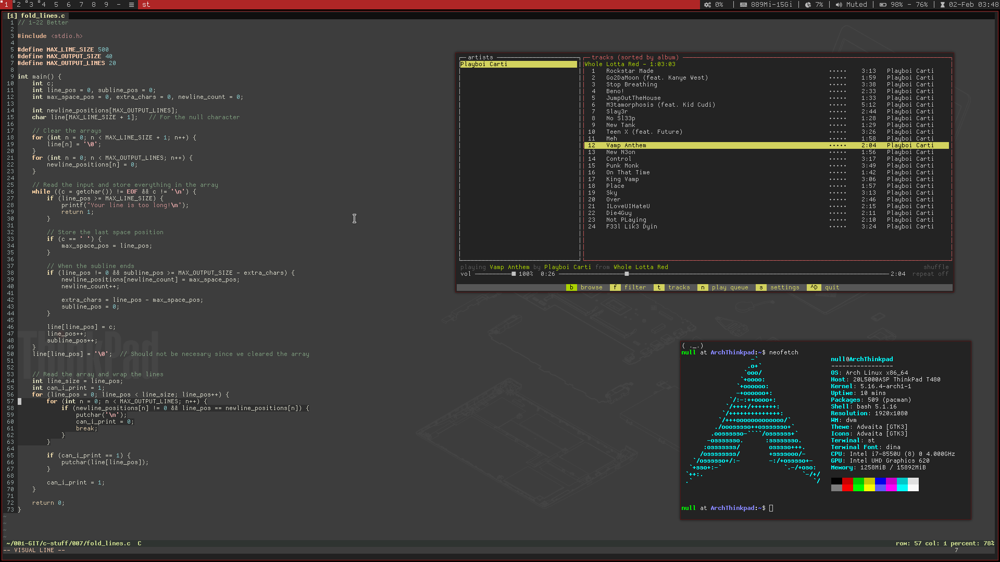
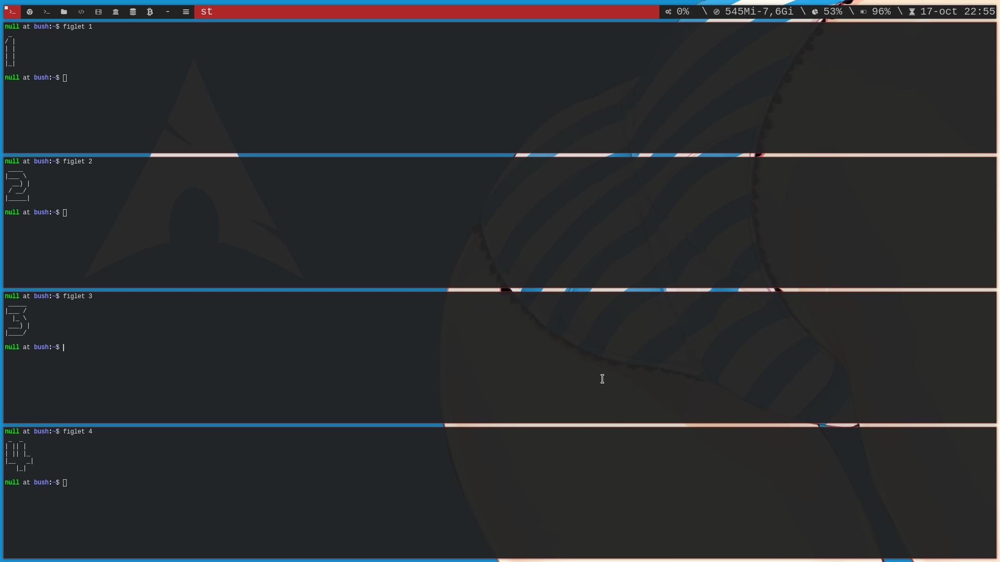
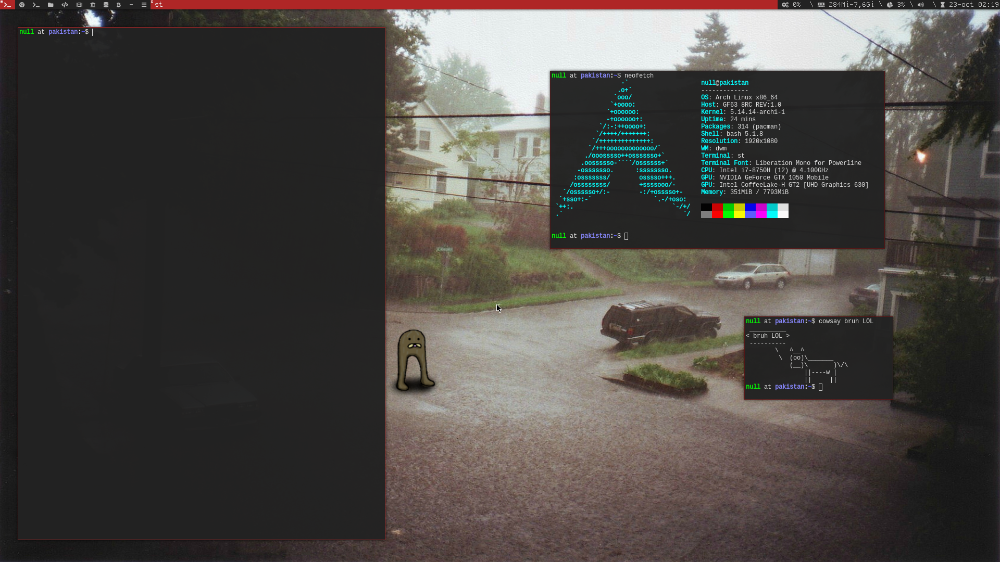

    <h1>Dotfiles</h1>
	<b>My dotfiles and configurations for linux</b>
	Simple version <a href="https://github.com/r4v10l1/dwm-lite">here</a>.  
	
	

## Table of contents
1. [Keys](#keys)
1. [Installation](#installation)
4. [Todo](#todo)
5. [Screenshots](#screenshots)

## Keys:
All the keys and shortcuts can be found [here](https://github.com/r4v10l1/arch-dotfiles/blob/main/dwm-cheatsheet.md).

## Installation
For installing in arch, check [`arch-installation.md`](arch-installation.md).

## Todo
- [ ] NixOS guide.
- [ ] Add [tag-previews](https://dwm.suckless.org/patches/tag-previews/) to dwm.

## Screenshots

